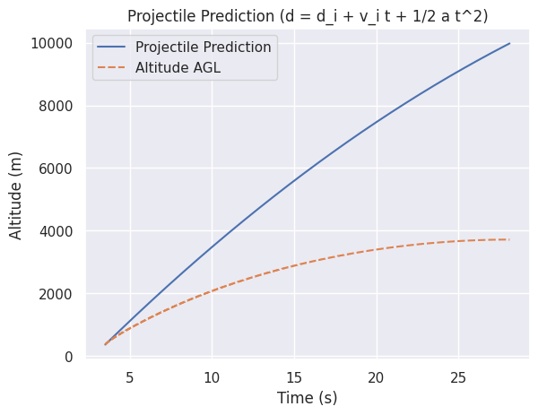

# Results

## 2nd Degree Polynomial Fit falls short
Using numpys polynomial fit with degree 2, the fit isnt perfect and it consistently predicts that the apogee is earlier than it will be. As time goes on, the predicted apogee approaches the real apogee but never reaches it.

> [!NOTE]  
> best guess from an armchair aerodynamicist: the parabola fit does not take into account drag which seems to be considerable. With drag as a function of velocity, a simple parabola doesn't fit it
> This is quite apparent if we assume the rocket is a projectile with no drag and use the simple kinematic equations to estimate position. With no drag, the estimate radically exceeds the observed data. 
> 

